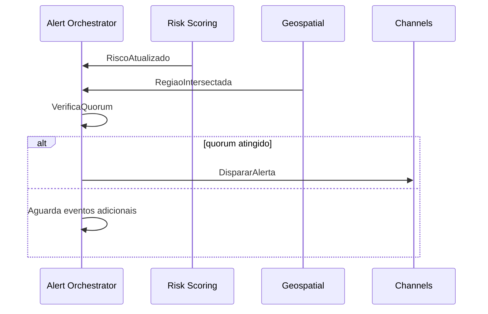

# 5. Orquestração de Alertas

O módulo de **Orquestração de Alertas** é responsável por avaliar riscos atualizados, aplicar regras de disparo, gerenciar escalonamento e quorum, e disparar alertas para os canais apropriados, garantindo auditoria e rastreabilidade de eventos críticos.

## 5.1 Regras de Disparo

As **regras de disparo** definem quando e como um alerta deve ser emitido com base nos dados de risco e eventos recebidos.

**Fontes de entrada:**

- `EventoClimaticoDetectado` (Ingestion Service)
- `RegiaoIntersectada` (Geospatial Service)
- `RiscoAtualizado` (Risk Scoring Service)
- Configurações do **Risk Catalog** e limites por tenant

**Fluxo:**

1. Recebe `RiscoAtualizado` do **Risk Scoring Service**.
2. Avalia contra limites e políticas configuradas:
   - Tipos de risco (incêndio, inundação, terremoto, etc.)
   - Intensidade mínima para disparo
   - Horários ou janelas específicas

3. Registra abertura de **Janela de Alerta** (`JanelaAlertaAberta`) no banco de dados de sagas (PostgreSQL / MongoDB) para rastreabilidade.
4. Caso regras atendidas, dispara comando `DispararAlerta` para o **Channels Service**.

**Exemplo de lógica simplificada:**

```csharp
if (riskScore >= threshold && alertWindowOpen)
{
    DispararAlerta();
}
```

---

## 5.2 Escalonamento e Quorum

Para garantir confiabilidade e minimizar falsos positivos, o **Orquestrador de Alertas** implementa:

### 5.2.1 Escalonamento

- Alertas podem ser escalonados em múltiplos níveis:
  - **Nível 1:** Notificação inicial para autoridades locais (SMS / WhatsApp)
  - **Nível 2:** Ativação de sirenes IoT
  - **Nível 3:** Comunicação para dashboards de defesa civil e relatórios agregados

- Escalonamento pode ser configurado por **tipo de risco**, **localização** e **tenant**.

### 5.2.2 Quorum

- Alguns alertas críticos exigem **confirmação de múltiplas fontes** antes do disparo:
  - Ex.: incêndio detectado por **sensor + satélite** ou **sensor + ML model**

- Implementação:
  - Contabiliza eventos recebidos (`EventoClimaticoDetectado`, `RegiaoIntersectada`)
  - Aguarda `quorum` mínimo antes de emitir `DispararAlerta`
  - Evita disparos duplicados ou falsos positivos

**Fluxo resumido do quorum:**



---

## 5.3 Integração com Outros Serviços

| Serviço                     | Papel na Orquestração                                                                  |
| --------------------------- | -------------------------------------------------------------------------------------- |
| **Ingestion Service**       | Fornece eventos normalizados (`EventoClimaticoDetectado`)                              |
| **Geospatial Service**      | Define regiões afetadas (`RegiaoIntersectada`)                                         |
| **Risk Scoring Service**    | Calcula risco atualizado (`RiscoAtualizado`)                                           |
| **Channels Service**        | Recebe comando `DispararAlerta` e envia notificações (SMS / Push / WhatsApp / Sirenes) |
| **Compliance / Audit**      | Armazena eventos de alerta (`AlertaDisparado`) para auditoria                          |
| **Reporting / Read Models** | Consolida alertas e métricas para dashboards e KPIs                                    |

---

## 5.4 Eventos e Comandos Relevantes

**Comandos:**

- `DispararAlerta` → AO → Channels
- `ConfirmarRecebimentoAlerta` → Channels → AO

**Eventos:**

- `JanelaAlertaAberta` → inicia contagem do tempo de alerta
- `AlertaDisparado` → registrado para auditoria
- `AlertaEntregue` / `AlertaConfirmado` → tracking e métricas de sucesso
