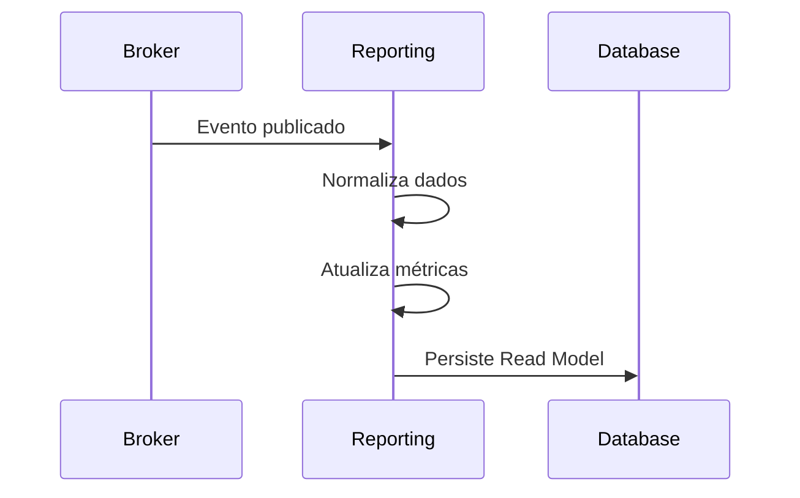

# 6. Reporting Service

O **Reporting Service** é responsável por consolidar, processar e disponibilizar dados analíticos produzidos pelos microsserviços do Sentinel.

Seu objetivo é fornecer consultas otimizadas para leitura, dashboards, indicadores operacionais (KPIs), auditoria e integração com ferramentas de Business Intelligence, sem impactar os serviços responsáveis pelas operações de escrita.

## 6.1 Consolidação de Dados

O serviço atua como um **Read Model** especializado, consumindo eventos publicados pelos demais microsserviços para construir modelos analíticos.

**Principais fontes de dados:**

- Alert Orchestrator
- Channels Service
- Risk Evaluation Service
- Ingestion Service
- Geospatial Service

**Fluxo:**

1. Consome eventos publicados no broker de mensagens.
2. Valida e normaliza os dados recebidos.
3. Atualiza modelos analíticos.
4. Persiste informações otimizadas para consulta.
5. Disponibiliza dados para APIs, dashboards e ferramentas externas.

**Fluxo simplificado:**

---

## 6.2 Indicadores (KPIs)

O serviço consolida indicadores utilizados para monitoramento operacional.

**Exemplos de KPIs:**

- Total de alertas disparados
- Alertas por severidade
- Alertas por região
- Alertas por tenant
- Taxa de entrega por canal
- Taxa de falha das notificações
- Tempo médio de entrega
- Tempo médio de processamento
- Eventos processados por período
- Risco médio por região
- Risco máximo registrado
- Utilização por tenant

Todos os indicadores devem ser derivados exclusivamente de eventos publicados pelos demais serviços.

---

## 6.3 Consultas Analíticas

O Reporting Service disponibiliza APIs especializadas para consultas de alta performance.

As consultas devem permitir filtros por:

- Tenant
- Região
- Tipo de evento
- Severidade
- Canal
- Intervalo de datas
- Status da entrega

As estruturas de persistência devem ser modeladas para leitura, evitando consultas complexas durante a execução.

---

## 6.4 Dashboards e Integrações

O serviço fornece dados para diferentes consumidores.

**Integrações suportadas:**

- Dashboard Web do Sentinel
- Painéis administrativos
- Grafana
- Power BI
- Sistemas de auditoria

As informações disponibilizadas devem refletir o estado atual da plataforma com consistência eventual.

---

## 6.5 Exportação de Relatórios

O serviço deve permitir exportação dos dados consolidados.

**Formatos suportados:**

- CSV
- JSON

Formatos futuros:

- XLSX
- PDF

A exportação deve utilizar as mesmas consultas disponibilizadas pela API, respeitando filtros e permissões do tenant.

---

## 6.6 Persistência

O Reporting Service utiliza armazenamento otimizado para leitura.

| Tecnologia        | Responsabilidade                                              |
| ----------------- | ------------------------------------------------------------- |
| **Elasticsearch** | Índices analíticos, agregações e consultas rápidas            |
| **PostgreSQL**    | Relatórios estruturados e armazenamento relacional (opcional) |
| **Redis**         | Cache de consultas frequentes                                 |

O modelo de persistência deve ser desacoplado dos bancos utilizados pelos demais microsserviços.

---

## 6.7 Comunicação com Outros Serviços

| Serviço                     | Papel                                                         |
| --------------------------- | ------------------------------------------------------------- |
| **Alert Orchestrator**      | Publica eventos relacionados ao ciclo de vida dos alertas     |
| **Channels Service**        | Publica eventos de entrega e falha das notificações           |
| **Risk Evaluation Service** | Publica alterações nos níveis de risco                        |
| **Ingestion Service**       | Publica eventos normalizados provenientes das fontes externas |
| **Geospatial Service**      | Publica informações sobre regiões afetadas                    |
| **Frontend / BI**           | Consome consultas e métricas disponibilizadas pela API        |

---

## 6.8 Eventos Consumidos

O Reporting Service consome eventos publicados pelos demais serviços.

**Eventos principais:**

- `AlertTriggered`
- `AlertDispatched`
- `NotificationSent`
- `NotificationFailed`
- `RiskUpdated`
- `SensorEventDetected`
- `SensorOffline`
- `SensorRecovered`

Todos os eventos consumidos devem ser processados de forma **idempotente**, evitando inconsistências em caso de reprocessamento.

---

## 6.9 Regras de Processamento

O serviço deve seguir as seguintes regras:

- Todo processamento é assíncrono.
- O serviço nunca deve bloquear o fluxo principal da plataforma.
- Eventos duplicados não podem alterar métricas.
- Os dados são eventualmente consistentes.
- Falhas temporárias devem permitir reprocessamento.
- Todo processamento deve ser auditável.

---

## 6.10 Observabilidade

O Reporting Service deve disponibilizar métricas para monitoramento operacional.

**Métricas recomendadas:**

- Eventos consumidos
- Eventos processados
- Eventos rejeitados
- Lag dos consumidores
- Tempo médio de processamento
- Tempo médio das consultas
- Falhas de agregação
- Utilização do cache

Além disso, o serviço deve possuir:

- Logs estruturados
- Tracing distribuído (OpenTelemetry)
- Health Checks
- Métricas Prometheus

---

## 6.11 Escalabilidade

O serviço deve suportar:

- Processamento assíncrono
- Escalabilidade horizontal dos consumers
- Particionamento por tenant
- Particionamento por região
- Múltiplas instâncias simultâneas

Como o serviço atua apenas como **Read Model**, sua escalabilidade deve ocorrer de forma independente dos microsserviços transacionais.
